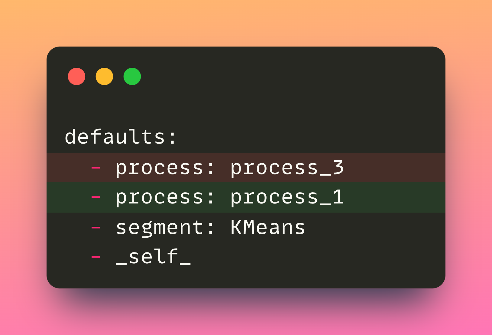
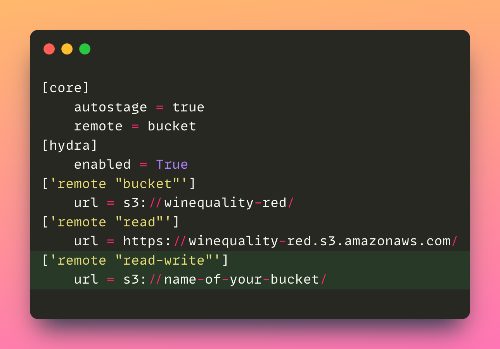
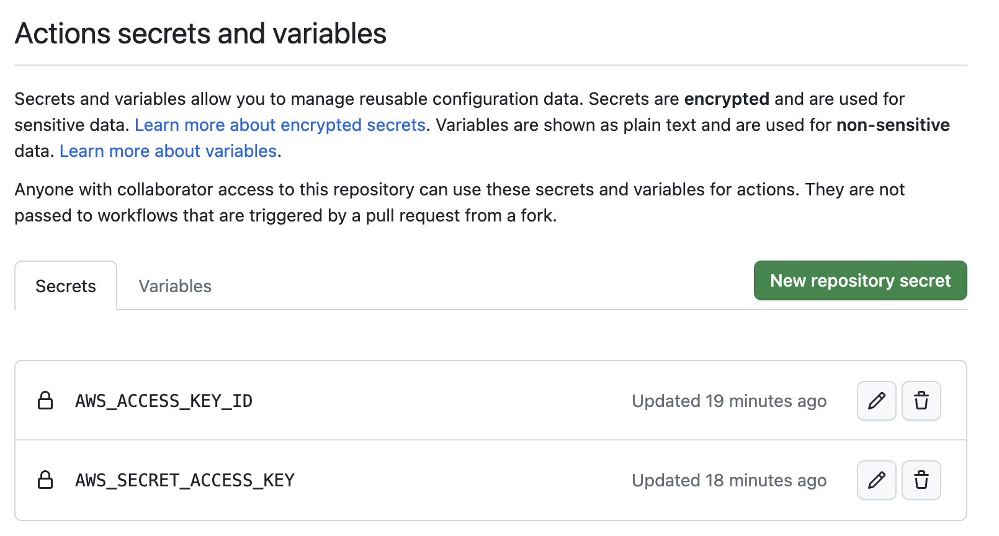
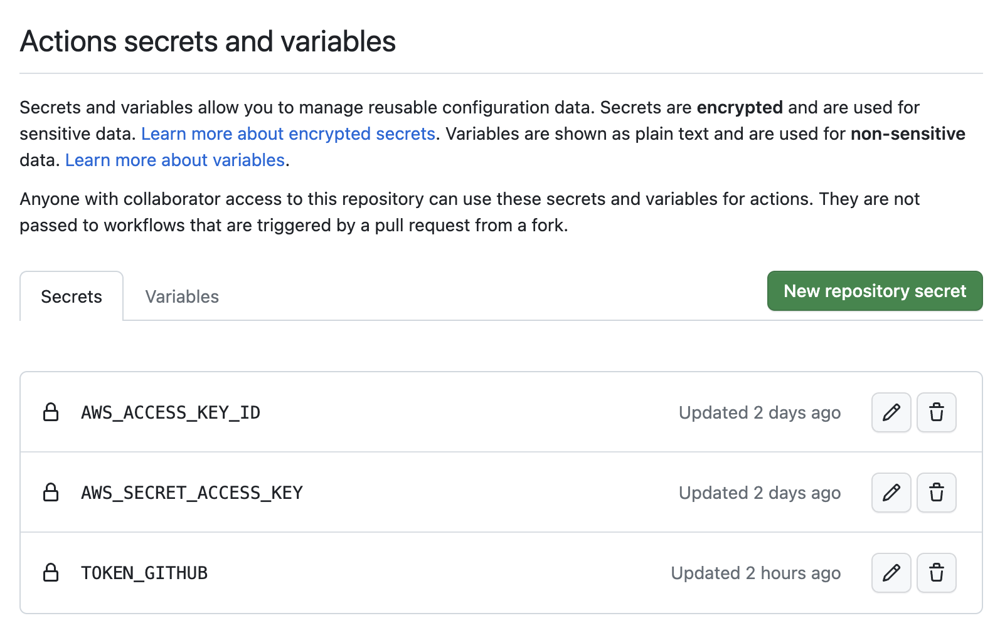
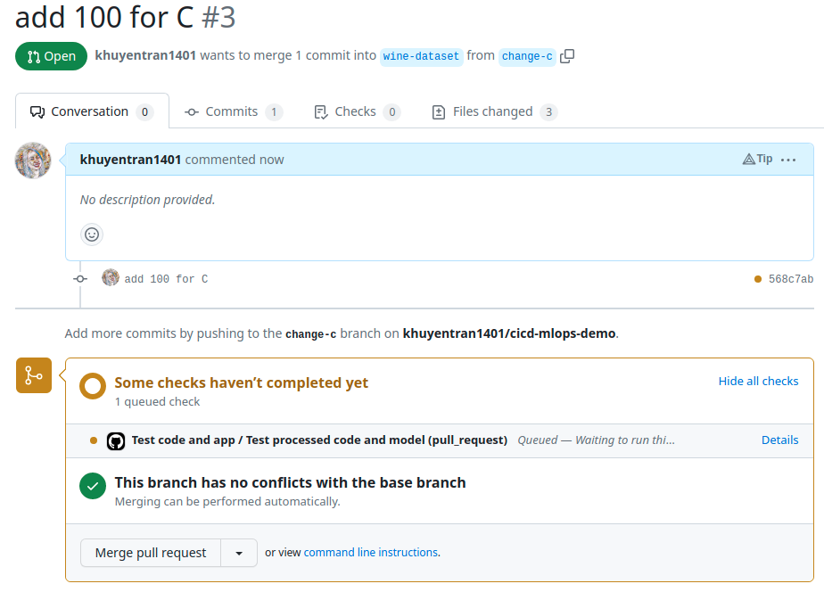
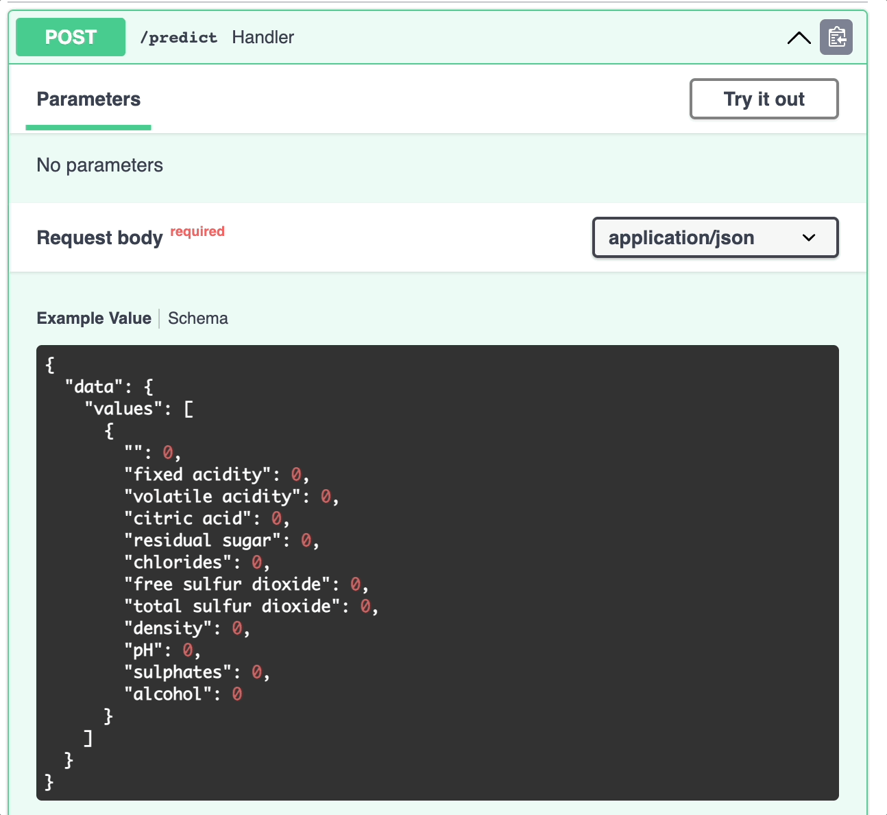

<div align="center">
<h1 align="center">
CI/CD for Machine Learning Models
 </h3>
  
[]([https://www.youtube.com/channel/UCNMawpMow-lW5d2svGhOEbw](https://youtu.be/rkg09nNMAhs)) 

Sample project for:

[Build Reliable Machine Learning Pipelines with Continuous Integration](https://towardsdatascience.com/build-reliable-machine-learning-pipelines-with-continuous-integration-ea822eb09bf6?sk=ae3326395e0c5bb219523a1c2014b1be)

[Automate Machine Learning Deployment with GitHub Actions](https://towardsdatascience.com/automate-machine-learning-deployment-with-github-actions-f752766981b1?sk=6e234bb505e6bc426bb4760e4b20da1b)

</div> 
  
## Why?
CI/CD (Continuous Integration/Continuous Deployment) is an essential practice for any software development project, including machine learning projects. It offers several benefits, such as:

:white_check_mark: **Catching errors early**: CI/CD facilitates the early identification of errors by automatically testing any code changes made, enabling timely problem detection during the development phase

:white_check_mark: **Better code quality**: CI/CD promotes better code quality by ensuring that changes are thoroughly tested before they are merged into the main branch, making it easier to maintain the codebase over time.

:white_check_mark: **Faster time-to-market**: CI/CD automates the build, testing, and deployment process, reducing the time it takes to release new models to production. 

## Scenario
- Data scientists create and push new model to remote storage.
- Data scientists create pull request for changes.
- CI pipeline tests code and model.
- Changes are merged if all tests pass.
- Merged changes trigger CD pipeline for model deployment.

## Tools Used in This Project
* [DVC](https://dvc.org/): Version data and experiments - [article](https://towardsdatascience.com/introduction-to-dvc-data-version-control-tool-for-machine-learning-projects-7cb49c229fe0)
* [CML](https://cml.dev/): Post a comment to the pull request showing the metrics and parameters of an experiment
* [MLEM](https://mlem.ai/): Deploy ML models

## Project Structure
* `src`: consists of Python scripts
* `data`: consists of data
* `tests`: consists of test files
* `model`: consists of ML models
* `dvclive`: consists of metrics of DVC experiments
* `.dvc/config`: consists of locations of the remote storage
* `params.yaml`: consists of parameters for Python scripts
* `dvc.yaml`: consists of data processes in the DVC pipeline 
* `.github/workflows`: consists of GitHub workflows

## Try it out
### Set up
To try out this project, first start with creating a new repository using the template.


Clone the project to your local machine:
```bash
git clone https://github.com/your-username/cicd-mlops-demo
```

Set up the environment:
```bash
# Go to the project directory
cd cicd-mlops-demo

# Create a new branch
git checkout -b experiment

# Install dependencies
pip install -r requirements.txt

# Pull data from the remote storage location called read 
dvc pull -r read
```

### Create experiments
Make changes to any files in the following directories `src`, `tests`, `params.yaml`. To demonstrate, we will make minor changes the file `params.yaml`:



Create an experiment:
```bash
dvc exp run
```

### Push model and data to a remote storage
After running the experiments, we need to store changes to our data and model remotely. One option is to use an S3 bucket as a remote storage.

Follow these steps to push your data and model to an S3 bucket:

1. [Create an S3 bucket](https://docs.aws.amazon.com/AmazonS3/latest/userguide/creating-bucket.html)
2. Ensure [your S3 credentials are store locally](https://docs.aws.amazon.com/cli/latest/userguide/cli-configure-files.html#cli-configure-files-methods).
3. Add the URI of your S3 bucket to the `.dvc/config` file


4. Push changes a remote location called `read-write` using:
```bash
dvc push -r read-write
```

### Push code changes to Git

Add, commit, and push changes to the repository:

```bash
git add .
git commit -m 'change svm kernel'
git push origin experiment
```

### Add Encrypted Secrets to GitHub Action
Encrypted secrets allows you to store your sensitive information in your repository. We will use encrypted secrets to make AWS credentials and GitHub token accessible by GitHub Actions.
#### AWS credentials
AWS credentials are necessary to pull data and model from your S3 bucket. Follow [this tutorial](https://docs.github.com/en/actions/security-guides/encrypted-secrets) to add `AWS_ACCESS_KEY_ID` and `AWS_SECRET_ACCESS_KEY` secrets to your repository.



#### GitHub token
GitHub token is necessary to write metrics and parameters as a comment in your pull request. To use GitHub token as an encrypted secret, follow these steps:
1. Create [a personal access token](https://docs.github.com/en/authentication/keeping-your-account-and-data-secure/creating-a-personal-access-token) 
2. Create a secret named `TOKEN_GITHUB` 
3. In the "Value" field, paste the token that you created in step 1.


### Create a Pull Request
Next, [create a pull request](https://docs.github.com/en/pull-requests/collaborating-with-pull-requests/proposing-changes-to-your-work-with-pull-requests/creating-a-pull-request).

The PR will trigger the CI pipeline to run tests. Once all tests passed, a comment will appear in the PR with the metrics and parameters of the new experiment. 



### Deploy the Model
Once the changes are merged, a CD pipeline will be triggered to deploy the ML model. Click the link under the "Deploy model" step to interact with the model. 


Click "Try it out" to try out the model on a sample dataset.


